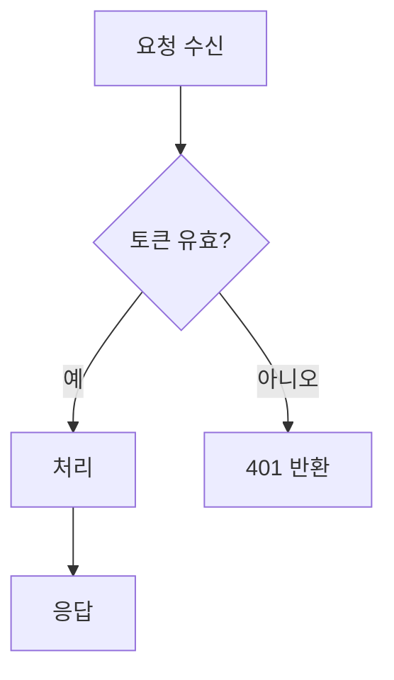
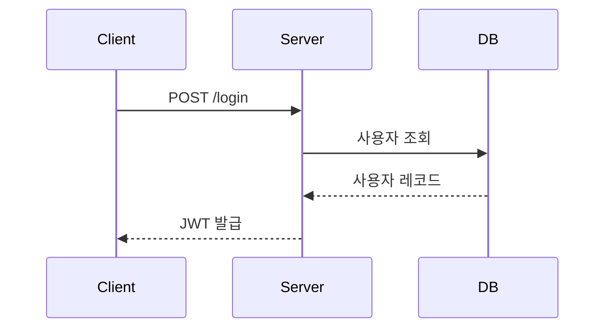
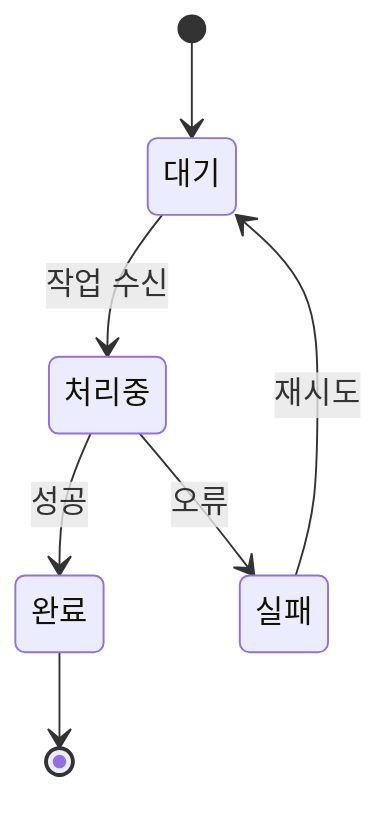
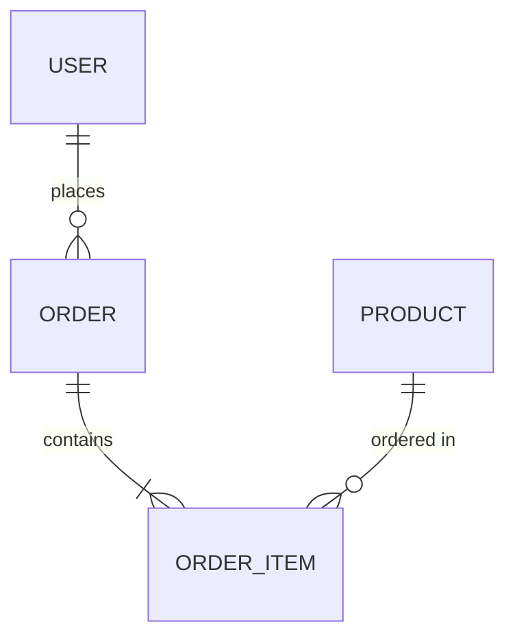
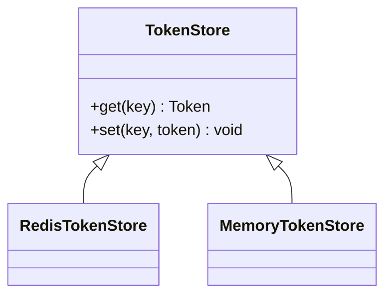
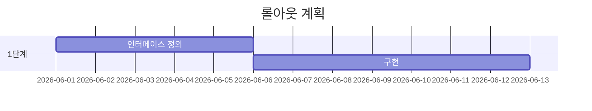

# Mermaid로 인지 부하 줄이기

이 문서는 `cognitive-writing` 스킬의 [9. 시각자료](../SKILL.md#9-시각자료-외재적-부하-) 규칙을 Mermaid에 한정해 확장한다. SKILL.md가 "Mermaid를 1순위로 고려하라"는 규칙이라면, 이 문서는 "어떤 종류를, 어떻게 그려야 인지 부하가 줄어드는가"의 전술이다.

전제: **사용 가능한 스킬 목록에 `plannotator-*` 스킬이 있을 때**(`plannotator-annotate`, `plannotator-last`, `plannotator-review` 등) 글은 Mermaid가 렌더링되는 환경에서 검토된다. 이 전제가 성립할 때 아래 전술을 적용한다. 렌더링 환경이 아니면(순수 터미널 등) Mermaid는 코드 덩어리로만 보이므로 무리하게 넣지 않는다.

## 목차

- [핵심 원칙](#핵심-원칙)
- [다이어그램 종류 선택](#다이어그램-종류-선택)
- [종류별 최소 예시](#종류별-최소-예시)
- [가독성을 높이는 작성 전술](#가독성을-높이는-작성-전술)
- [안티 패턴](#안티-패턴)
- [출력 직전 자가 점검](#출력-직전-자가-점검)

## 핵심 원칙

Mermaid의 풍부한 기능은 **가독성을 높이는 데만** 쓴다. 기능을 과시하려고 한 다이어그램에 모든 정보를 욱여넣으면 외재적 부하가 오히려 폭증한다. 글쓰기 4원칙은 다이어그램에도 그대로 적용된다.

| 글쓰기 원칙 | 다이어그램에서의 적용 |
|---|---|
| 내재적 부하 ↓ — 분할 | 한 다이어그램 = 한 관심사. 흐름과 데이터 모델을 한 그림에 섞지 않는다. 크면 여러 장으로 쪼갠다. |
| 외재적 부하 ↓ — 제거 | 주제에 맞는 종류를 고르고, 노드·엣지를 7±2로 유지하며, 방향을 일관되게 둔다. |
| 본유적 부하 유도 | 엣지 레이블에 "왜/조건"을 적어 독자가 같은 추론을 반복하지 않게 한다. |
| 작업기억 보호 — 점진 공개 | 큰 시스템은 상위 다이어그램(전체 골격) → 하위 다이어그램(세부)으로 단계 공개한다. |

**한 줄 요약**: "줄글로 설명하면 독자가 머릿속에서 그려야 하는 관계"는 Mermaid로 그리고, "그림이 오히려 더 복잡해지는 단순 사실"은 줄글로 둔다.

## 다이어그램 종류 선택

표현하려는 **관계의 본질**에 따라 종류를 고른다. flowchart가 만능이 아니다 — 잘못된 종류를 쓰면 같은 정보가 더 어렵게 읽힌다.

| 본질 | 권장 종류 | 전형적 용도 |
|---|---|---|
| 분기·조건이 있는 **흐름/제어** | `flowchart` | 알고리즘 로직, 의사결정 트리, 파이프라인, 배포 흐름 |
| 컴포넌트 간 **시간순 상호작용** | `sequenceDiagram` | API 호출 순서, 인증 핸드셰이크, IPC·메시지 교환 |
| 객체의 **상태 전이** | `stateDiagram-v2` | 주문 라이프사이클, 연결 상태 머신, 토큰 만료 |
| 데이터 **엔티티·관계** | `erDiagram` | DB 스키마, 테이블 관계, 도메인 모델 |
| 타입·**클래스 구조와 관계** | `classDiagram` | 클래스 상속·구현, 모듈 의존 구조, 인터페이스 계약 |
| **일정·의존이 있는 작업** | `gantt` | 마일스톤, 단계별 일정, 롤아웃 계획 |
| **계층적 발상 정리** | `mindmap` | 요구사항 분해, 브레인스토밍, 범위 정의 |
| **사용자 경험 단계별 만족도** | `journey` | 온보딩 흐름, UX 단계별 마찰점 |
| **브랜치 전략·커밋 흐름** | `gitGraph` | 릴리스 전략, 브랜치 모델 설명 |
| 부분/비율 **구성비** | `pie` | 단순 비율(소수일 때만; 정밀 비교는 표가 낫다) |
| **요구사항-검증 추적** | `requirementDiagram` | 요구사항과 테스트·설계 요소 연결 |
| 시스템 **경계·컨테이너 구조(C4)** | `C4Context` / `C4Container` | 아키텍처 컨텍스트, 시스템 경계 |

선택이 애매하면: "독자가 **순서**를 알아야 하면 sequence, **분기**가 핵심이면 flowchart, **상태**가 핵심이면 state, **데이터 모양**이 핵심이면 ER"을 기본값으로 삼는다.

## 종류별 최소 예시

각 종류의 가장 작은 형태. 실제 글에서는 노드 7±2를 넘지 않는 선에서 확장한다.

### flowchart — 분기 흐름



엣지 레이블(`-- 예 -->`)에 분기 조건을 적어 "왜 이 경로인가"를 그림 안에서 답한다.

### sequenceDiagram — 시간순 상호작용



실선 화살표(`->>`)는 호출, 점선(`-->>`)은 응답. 동기/비동기, 분기는 `alt`/`opt`/`loop` 블록으로 묶는다.

### stateDiagram-v2 — 상태 전이



### erDiagram — 데이터 모델



카디널리티 기호(`||`, `o{`, `|{`)로 1:1·1:N·N:M을 표현한다.

### classDiagram — 타입 구조



### gantt — 일정



## 가독성을 높이는 작성 전술

기능을 더 쓰는 게 목적이 아니라, **독자의 눈 이동과 작업기억 부담을 줄이는 것**이 목적이다.

- **방향 일관성**: flowchart는 `TD`(위→아래) 또는 `LR`(왼→오)을 한 다이어그램 안에서 고정한다. 시간·절차 흐름은 보통 `LR` 또는 `TD`로 한 방향으로만 흐르게 해 교차(엣지가 서로 가로지름)를 없앤다.
- **subgraph로 그룹핑**: 관련 노드를 `subgraph`로 묶어 청크 수를 줄인다. 7±2는 노드가 아니라 "독자가 인식하는 덩어리" 기준이다 — 12개 노드도 3개 subgraph로 묶이면 3청크다.
- **의미 있는 레이블**: 노드 ID(`A`, `B`)가 아니라 노드 텍스트에 도메인 용어를 쓴다. 엣지에는 조건·이벤트("성공 시", "토큰 만료")를 단다. 빈 화살표는 본유적 부하를 추론으로 낭비시킨다.
- **노드 모양으로 종류 구분**: `[사각]`=프로세스, `{마름모}`=분기, `([둥근]) `=시작/끝, `[(원통)]`=저장소. 모양이 일관되면 독자가 범례 없이도 역할을 읽는다.
- **강조는 절제**: `classDef`로 핵심 경로(해피 패스)나 위험 노드만 색으로 강조한다. 모든 노드를 칠하면 강조가 사라진다. 색은 의미(예: 빨강=실패 경로)에 묶어 일관되게 쓴다.
- **계층 분할(점진 공개)**: 시스템 전체를 한 장에 그리지 말고, "전체 컨텍스트 1장 → 핵심 흐름별 세부 N장"으로 나눈다. 각 장은 독립적으로 한 화면에 잡혀야 한다.
- **다이어그램 + 한 줄 캡션**: 다이어그램 바로 위/아래에 "무엇을 보여주는가"를 한 줄로 적어 독자가 그림을 보기 전에 읽는 의도를 잡게 한다.
- **마크다운 규칙 준수**: ```` ```mermaid ```` 펜스로 감싸고, 다이어그램 앞뒤로 빈 줄 1개를 둔다(SKILL.md "코드 블록" 규칙과 동일).

## 안티 패턴

| 안티 패턴 | 인지 부하 영향 | 대응 |
|---|---|---|
| flowchart 하나에 흐름·상태·데이터 전부 표현 | 내재적+외재적 폭증 | 관심사별로 종류를 나눠 여러 장으로 |
| 노드 20개+ 단일 다이어그램, 엣지 교차 | 작업기억 초과 | subgraph 그룹핑 + 계층 분할 |
| 엣지에 레이블 없음(빈 화살표) | 본유적 부하를 추론으로 낭비 | 조건·이벤트 레이블 부착 |
| 방향 혼재(`TD`+`LR`+역방향 엣지) | 시선 이동 혼란 | 한 다이어그램 = 한 방향 |
| 모든 노드 색칠 / 무지개 색 | 강조 소실 | 핵심·위험 노드만 의미 기반 강조 |
| 노드 ID(`A`,`B`)만 보이는 무의미 텍스트 | 매핑 비용 | 도메인 용어 레이블 |
| 단순 사실·2~3항목 비교를 억지로 다이어그램화 | 양식 비용 > 본질 | 줄글·표로 (조건부 축약) |
| 렌더링 안 되는 환경인데 거대 Mermaid 삽입 | 코드 덩어리로 부하 ↑ | `plannotator-*` 유무 확인 후 결정 |

## 출력 직전 자가 점검

- [ ] 표현하려는 **관계의 본질**에 맞는 종류를 골랐는가(흐름/순서/상태/데이터/구조)
- [ ] 한 다이어그램이 **한 관심사**만 다루는가
- [ ] 독자가 인식하는 **청크 수가 7±2 이내**인가(subgraph 포함)
- [ ] **방향이 일관**되고 엣지 교차가 최소화됐는가
- [ ] 엣지·노드 레이블이 **도메인 용어와 조건**을 담는가
- [ ] 강조(색)가 **의미에 묶여 절제**됐는가
- [ ] 거대 시스템을 **계층 분할**해 한 화면에 잡히게 했는가
- [ ] ```` ```mermaid ```` 펜스와 앞뒤 빈 줄 등 **마크다운 규칙**을 지켰는가
- [ ] 이 다이어그램이 줄글보다 **정말 부하를 줄이는가**(아니면 줄글·표로)
